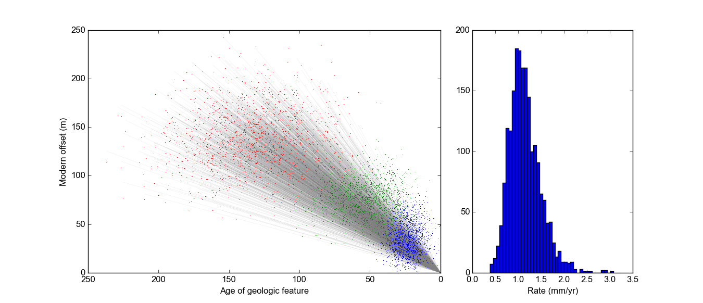
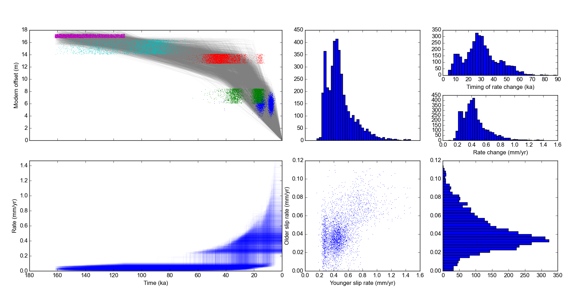
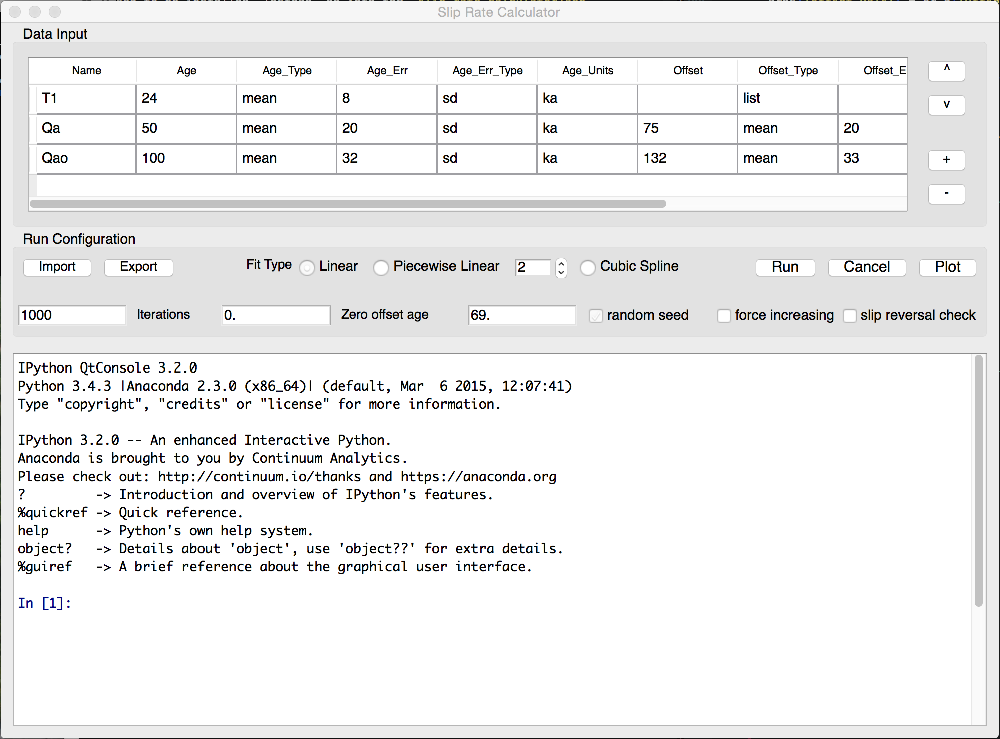

Slip Rate Calculator
====================

[](http://dx.doi.org/10.5281/zenodo.33360)

The Slip Rate Calculator is a tool that takes probability distributions for age
and offset distance for geologic (or other) features cut by a fault and
calculates the probability distribution of the fault's slip rate via Monte
Carlo methods. The idea is to use empirical estimates of the probability of the
ages and offsets directly from field observations and analytical measurements,
rather than canned PDFs (uniform, Gaussian, etc.), when possible. It's not
always, though, so some canned PDFs are supported.

Typically, the offset features (called `offset markers`) show *cumulative
offset*, i.e. all the `offset markers` that are present on a fault at a given
time interval experience the same offset amount over that time.



The Slip Rate Calculator can also calculate slip rates that change through
time, either by fitting a piecewise line (with a specified number of segments)
or a cubic spline. The piecewise fitting routine also includes a statistical
test (based on the [Bayesian Information Criterion][bic]) to determine whether
there was a slip rate change at some point in the past.


(data from [Lifton et al., 2015](http://onlinelibrary.wiley.com/doi/10.1002/2013TC003512/full).)


[bic]: https://en.wikipedia.org/wiki/Bayesian_information_criterion

The Slip Rate Calculator is [MIT licensed](LICENSE.txt).

## Installation
The Slip Rate Calculator is a Python 3 application. It depends heavily on the
core Python scientific stack, as well as PyQt4. The easiest way to get
everything running is to install the free [Anaconda Python 3.5][anaconda]
scientific Python distribution. It doesn't interfere with your system Python,
or any other Python versions you may have on your computer.

[anaconda]: https://store.continuum.io/cshop/anaconda/
[release]: https://github.com/cossatot/slip_rate_calculator/releases


Then, either download a [release][release] if you don't have or don't want
to use `git`, or (if you want easy updates) clone the git repository:

```
git clone https://github.com/cossatot/slip_rate_calculator.git
```

__Note:__ PyQt is now at version 5 in Anaconda's repository, which is
incompatible. The easiest way to install a functioning Python environment is to 
use Anaconda's environment system. From the `slip_rate_calculator` directory, 
with Anaconda or Miniconda installed, type in the terminal:
```
conda env create -f slip_rate_calculator_env.yml

```
and follow the directions in the terminal.

To activate the environment to be able to run the Slip Rate Calculator, type:
```
source activate slip_rate_calculator
```
if you're on Linux/MacOS, or
```
activate slip_rate_calculator
```
if you're on windows.

The Slip Rate Calculator (which does need a more clever name) itself doesn't
need to be installed. Instead, go into the `slip_rate_calculator/app`
directory and run `python SlipRateGUI.pyw` or `./SlipRateGIU.pyw`.

Note: Because the Slip Rate Calculator has an embedded IPython console, it
can't be run using IPython.

### Dependencies
The actual calculator uses `numpy`, `scipy` and `pandas` in addition to the
standard Python library. The GUI uses `PyQt4` and `IPython` as well. It may
work with Python versions other than 3.4 (e.g. 2.7) but has not been tested.

## Basic Theory and Implementation
The Slip Rate Calculator is based on the formulation of fault offset as a
function of time:

*offset = ƒ(age)*

Therefore, the slip rate (i.e. the rate of fault offset) is also a function of
time, i.e. the first time derivative of *ƒ*:

*slip rate = ƒ'(age) = ∂ƒ / ∂ age*

This fault offset function *ƒ* can take a variety of forms: 
- linear 
- piecewise linear
- cubic spline (i.e. continuously-varying)

This formulation of slip rate is both flexible (allowing for the different
forms of *ƒ*) and very tractable computationally, because it makes the
calculation into a regression problem. Additionally, the regression framework
makes it much more simple to incorporate multiple `offset markers` than other,
convolution-based slip rate calculators ([Bird, 2007](b7); [Zechar and Frankel,
2009](zf9)), particularly when considering slip rate changes in time.


[b7]: http://geosphere.gsapubs.org/content/3/6/577.short
[zf9]: http://onlinelibrary.wiley.com/doi/10.1029/2009JB006325/full


### Implementation details

#### PDF sampling

Sampling of the PDFs for age and offset are done through different methods
depending on the type of PDF. The canned Gaussian, uniform, etc. PDFs are 
sampled using NumPy's stock algorithms.

The arbitrary/empirical PDFs are sampled using an inverse transform sampling
algorithm, where the points of the PDF are linearly interpolated between, and
then are made into a empirical cumulative distribution function, to which the
[inverse transform sampling][ie] algorithm is applied.


[ie]: https://en.wikipedia.org/wiki/Inverse_transform_sampling

#### Regression

Currently, only linear and piecewise-linear fitting is supported. Linear
fitting is perfomed as a Linear Least Squares (LLS) regression with the 
*x*-intercept fixed at the `zero offset age`, which is the age at which no
offset occurs (i.e. the present for active faults).

Piecewise-linear fitting is a nonlinear regression problem if the *x*
coordinates (the ages) of the slip rate changes, called breakpoints, are not
known. If they are known, it is a LLS problem. The Slip Rate Calculator employs
a Monte Carlo method to deal with the nonlinearity: Some number (e.g. 20) of
breakpoints are randomly sampled from a uniform distribution between 0 years
and the age of the oldest `offset marker`. Then, a piecewise fit is performed
given each of the breakpoints, and the best least squares fit is chosen. Tests
have shown this is fast and yields better results than typical nonlinear
inversion routines, because the sparsity of data yields a very ill-posed
problem for e.g. gradient descent methods. Additionally, some rate change
penalization can be applied, because for certain situations the goodness of fit
between two fits can be identical even though one calls for a much more radical
change in slip rate, like in the following situation (forgive the bad art):

```
  x
  |\
  | \
  |  \
  o---o-x----x------x

(o = slip rate change
 x = data point)
```
Here, the diagonal fit produces a much more geologically reasonable slip rate
change, because the other fit (basically vertical) is like going from 0 to
infinite slip rate, even though both fit the data points perfectly. Having some
slip rate change penalization helps here.

Note that the Monte Carlo iterations described in the above paragraph are not
the same as used for the whole slip rate calculation. They're more like an
'inner loop'.


#### Handling of multiple `offset markers`

Because the Slip Rate Calculator is based on regression, multiple `offset
markers` are treated very naturally, as multiple data points. However,
there are a two different ways the data may be handled, which are appropriate
for different geological scenarios:

1. The data are from the same location and show *cumulative offset*, i.e. the
   slip rate at any time is the same for all `offset markers` that exist at
   that time. In this instance, barring slip changes on the fault, older
   markers should always be more offset than younger markers. In this case,
   `Force increasing` should be set in the GUI. When this option is set, for
   each Monte Carlo iteration, it is ensured that the older data point is
   more offset than the younger data point, but the PDFs themselves are not
   'trimmed' pre-sampling (which is statistically inappropriate, as 
   that would force the PDFs into two separate, independent, non-overlapping
   PDFs instead of the actual overlapping, but mutually conditional PDFs).

2. The data are from the same fault or fault zone, but may be from different
   places along strike, where it is possible that slip rate may be spatially
   variable. In this case, there is no a-priori requirement that older samples
   must be more offset than younger samples, so `Force increasing` does not
   have to be set. The Slip Rate Calculator would then calculate a best-fit
   slip rate considering all of these data.

## Basic Usage

Using the Slip Rate Calculator is fairly simple, at least relative to
collecting the data. The GUI has three components: An interactive table for
data entry, a box with various field and buttons and stuff for configuring and
running the calculations, and an IPython console at the bottom.



Basically, the data and metadata for each `offset marker` should be added to
the table, then the options for the run configuration should be set, and then
the `Run` button should be pressed. Once the run is finished, some results
and statistic will be displayed in the IPython console at the bottom. At this
time, the user can hit the `Plot` button and plots of the results will appear.

All data and run configuration settings can be imported, modified (in or out
of the GUI) and exported; settings are stored internally as Python `dicts`
and externally as [`JSON`](https://en.wikipedia.org/wiki/JSON) files.
This is really helpful for reproducing the runs, as well as entering long
lists of numbers (for arbitrary PDFs of age or offset).

Though the IPython console is interactive and fully featured, nothing needs to
be typed into it.

### Data Entry

This is a table where the `offset markers` are added. Each row is an `offset
marker`.  There are 11 fields for each offset marker: 1 for the name, and then
5 for the age data and 5 for the offset data. The fields for age and offset are
very similar, differing mainly in their units.

The fields can be added or deleted with the `+` and `-` buttons. The data
should be layed out in youngest (top) to oldest (bottom) order. Eventually the
`^` and `v` buttons will allow the rows to be moved around but that isn't
implemented yet.


Field  | Data type       |  Units  | Options | Example
-------|-----------------|---------|---------|--------
`Name`  | String         | (none)  | (none)  | `T1`
`Age`   | Numeric        | time    | Number or list of numbers | `10` or `[23.,27.5,29.2]`
`Age_Type` | String      | (none)  | `mean`, `median`, `list` | `median`
`Age_Err` | Numeric      | time    | Number or list of numbers | `7` or `[0., 0.53, 0.2]`
`Age_Err_Type` | String  | (none)  | `sd`, `mad`, `minmax`, `probs` | `minmax`
`Age_Units` | Numeric    | time    | `ka` (for now) | `ka`
`Offset` | Numeric       | distance| Number or list of numbers |`10` or `[23.,27.5,29.2]`
`Offset_Type` | String   | (none)  | `mean`, `median`, `list` | `list`
`Offset_Err` | Numeric   | distance| Number or list of numbers | `7` or `[0., 0.53, 0.2]`
`Offset_Err_Type` |String| (none)  | `sd`, `mad`, `minmax`, `probs` | `probs`
`Offset_Units` | String  | distance|`m` (for now)  | `m`

#### Explanations:
`Name` : The name of the `offset marker` (typically the geologic unit or other
descriptor)

`Age` : The age of of the `offset marker`. If this is a single value, it is the
'central' or most-likely age (`mean` or `median`). If this is a range of
values, it needs to be of `Age_Type`==`list` and the `Age_Err` also needs to be
a list of the same length. 

`Age_Type` : What the value in the `Age` field represents.

`Age_Err` : The error (uncertainty) of the `Age` measurements. Needs to be the
same length as `Age`; i.e. if `Age` is a scalar, then `Age_Err` does too, and
if `Age` is a list, then `Age_Err` needs to have the same number of elements.
If these are lists, `Age_Err` is the *scaled probability* of the corresponding
element in the `Age` list. These probabilities are basically on the same
arbitrary and don't have to add up to 1 or any other value; they could all be
on a 0-10 scale or whatever. 0 always means 0 though.

`Age_Err_Type` : The type of uncertainty given by the `Age_Err` field. This can
be `sd` for the standard deviation (to be used with `Age_Type`==`mean`), `mad`
for the median absolute deviation (to be used with `Age_Type`==`median`),
`minmax` for the half-width of a uniform distribution (where the center of the
distribution is specified by the `Age`, with `Age_Type`==`mean`).

`Age_Units`: This should be self-explanatory.  Currently the everything is in
thousand years (`ka`).  Later, other units will be allowed.

Offset fields are exactly the same as ages. 

##### Choosing and specifying PDFs
*Arbitrary PDFs*

This is one of the major reasons for using this tool instead of others. Most of
the time, the best estimates for the probablity distributions of the age or
offset of an `offset marker` are *not* uniform or Gaussian PDFs. The offsets
should be empirically specified based on mapping, trenching or remote sensing,
using the geologist's knowledge and intuition. The ages should come directly
from analytical measurements (or the like) and may also be truncated by
cross-cutting relationships or whatever other constraints.

To use an arbitrary PDF, you want ot make a list of *x* values and a list of
*y* (or *p*(*x*)) values. For a trapezoid of offset values, you can do
something like this:

`Offset = [3., 5., 9., 9.01]`

`Offset_Err = [0., 4., 4., 0.]`

which would correspond to a PMF that looks like this:
```
4      *-------*
3     /        |
2    /         |
1   /          |
0  *           *
   3 4 5 6 7 8 9
```

In this case, the `Offset_Type` should be `list` and the `Offset_Err_Type`
should be `probs`.

*Standard PDFs*

For a uniform PDF, use a scalar `Age` or `Offset` value, `Age_Type` or
`Offset_Type` set to `mean`, `Age_Err` or `Offset_Err` set to the distance
between the middle (mean) and either side of the PDF (i.e. half the uniform PDF
width), and the `Age_Err_Type` or `Offset_Err_Type` to `minmax`.

For a Gaussian PDF, use a scalar `Age|Offset` value, `Age|Offset_Type`==`mean`,
a scalar `Age|Offset_Err` value, and `Age|Offset_Err_Type`==`sd` (standard
deviation). Because you do not have a time machine for fieldwork, the Gaussian
PDFs for `Age` will be truncated at 0, meaning no ages from the future will be
allowed. Offsets are allowed to have negative tails, as uncertainty in slip
direction is somewhat more common than rocks from the future.

For a Laplacian PDF (should you require one), use a scalar `Age|Offset` value,
`Age|Offset_Type`==`median`, scalar `Age|Offset_Err`, and `Age|Offset_Err_Type`
to be `mad` (Median Absolute Deviation). Trimming of negative ages isn't
currently implemented, mostly because of disuse.


### Run Configuration
This is pretty straightforward.

#### Fit Type
Options are `Linear`, `Piecewise Linear`, or `Cubic Spline`.

`Linear` fitting is simply a least-squares regression line through each set
(iteration) of samples from the data.

`Piecewise Linear` is a continuous set of line segments that fit the data. Each
adjacent pair of line segments is separated by a *breakpoint*, when the slip
rate change occurs.

Mathematically, the number of linear segments is constrained to be equal or
smaller than the number of data points (not counting the `zero_offset` point).
This number is set in the field to the right of the `Piecewise Linear` button.
Currently, only two points are supported. The fitting algorithm itself doesn't
have this constraint, but the plotting and some other statistics functions are
not yet as flexible.

The `Piecewise Linear` fitting is a nonlinear problem and is substantially
(~25x) slower than the `Linear` fitting. Nonetheless, it is still reasonably
fast. For example, it should take about 3-4 seconds on a modern laptop to do
a fitting with 1000 iterations.

`Cubic Spline` fitting is not implemented yet, but is basically an exact
spline-based fit to the data. Because splines can fit exactly, there is no
error associated with the splines. They're perfect! So this will have some
different uses, for example tying geodetic, neotectonic and geologic data over
different orders of time and displacement magnitude, where the data are sparse
and widely-spaced enough that no linear fit is required or expected to fit.

#### Run Settings

`Iterations`: This is how many Monte Carlo iterations are done. In each
iteration, an age and an offset is sampled from the constructed PDFs, and a
line is fit.  Depending on the complexity of the system and the desired type of
fit, somewhere between 1000 to 10,000 iterations is useful and quick (a second
to a minute on a modern computer). For publication, 100,000 iterations will
probably be on the overkill side of acceptable. (Note that some of the runs
will produce too bad of fits and will be rejected, especially with `Piecewise
Linear` fitting).

`Zero offset age`: This is the (younger) age at which no offset occurs.  I.e.
for an active fault, it would be 0. For a Cretaceous fault, it could be 60,000
(data in ka).  Currently no uncertainty used in this estimate, although this
will change in the future.

`Random Seed`: This is an option to set a 'random seed', which is a value used
to get a predictable sequence of pseudorandom numbers. The reason for doing
this is that it makes Monte Carlo simulations and other stochastic or
random-number based methods completely reproducible. Note that for our
purposes, these pseudorandom numbers are definitely random enough for
statistical robustness. This option is set through a check box, and a numerical
value to be used is typed in the field.

`Force increasing data`: This ensures that the ages and offsets for each
iteration are monotonically increasing.  It does *not* ensure that the best-fit
rates will be everywhere positive, although it strongly increases the
likelihood of this.

`Allow slip reversals`: This box allows the sign of the slip rate to change. It
defaults to `False`.


#### Importing and exporting
There are two buttons that do this exactly. They open up `File Open`-type
dialongs that allow you to input or export (save) a `JSON` file that has all of
the data and the run configuration.


### Intermediate Usage
For users with some knowledge of the Python data stack, once the data are input
and run for the first time, the user can type commands to do different
analysis, make new plots, and whatnot through the IPython interface. 

One feature of the embedded IPython console is that all of the GUI commands for
running and plotting are done through the IPython interpreter instead of the
Python interpreter in the background that runs the GUI: all of the buttons and
so forth directly send text commands to the IPython interpreter. This makes it
so that the user can read the exact commands that were sent, modify them, learn
from them, etc. Additionally, the `slip_rate_tools` module that does the real
science can be called directly, and has text completion and docstrings exposed.

### Advanced Usage
All of the scientific functionality is implemented through the
`slip_rate_tools` module that is packaged with the Slip Rate Calculator. This
module is poorly documented at present, but it can be imported and used in
other scripts, programs, etc. to do lots of different tasks.

Functionality includes:
- Creation and sampling of PDFs for age and offset based on the input data 
  fields, including things like multi-dimensional PDFs of offset on multiple
  features, accounting for conditional probabilities imposed by cross-cutting 
  relationships or monotonically-increasing offset with age requirements.
- Linear, piecewise-linear, and spline fitting of age/offset pairs (or other xy 
  data).
- Probably some other stuff.

Most of this functionality is exposed through the GUI but it could be used
differently for different use cases. For example, one could use an iterative
fitting to refine PDFs of offset on a feature based on how well the fit for the
whole system fits that particular offset marker.

Additionally, some slightly different fitting algorithms could be used based on
different use of the fitting functions; they are quite modular and could be
used creatively based on different needs or information (i.e. breakpoints could
be fixed for piecewise regression quite easily).

## Forthcoming Features
- [ ] Spline fitting of `offset markers`
- [ ] KDE estimates of Age or Offset from lists of values (probabilities 
      internally generated).
- [ ] Automatic unit conversion
- [ ] Log/Log fitting (helpful for geodetic through geologic slip histories)
- [ ] Webapp (!!!)
- [ ] Sliders on rate/time and offset/time plots to get PDFs at any time
- [ ] Incorporation of uncertainty in the `zero offset age` and fitting of this
      (to determine when slip on an old fault may have stopped, for instance)
- [ ] Excel I/O

See [Issues](https://github.com/cossatot/slip_rate_calculator/issues) to browse
or suggest others. Suggestions are quite welcome!
