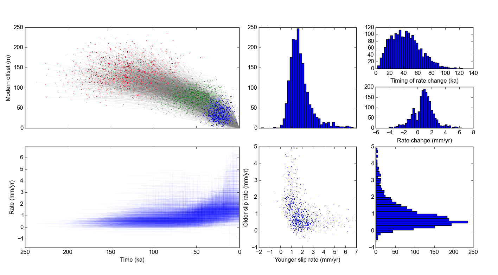

Slip Rate Calculator
====================

The Slip Rate Calculator is a tool that takes probability distributions for age
and offset distance for geologic (or other) features cut by a fault and
calculates the probability distribution of the fault's slip rate via Monte
Carlo methods. Typically, the offset features (called `offset markers`) show
*cumulative offset*, i.e. all the `offset markers` that are present on a fault
at a given time interval experience the same offset amount over that time.


The Slip Rate Calculator can also calculate slip rates that change through
time, either by fitting a piecewise line (with a specified number of segments)
or a cubic spline. The piecewise fitting routine also includes a statistical
test (based on the [Bayesian Information Criterion][bic]) to determine whether
there was a slip rate change at some point in the past.




[bic]: https://en.wikipedia.org/wiki/Bayesian_information_criterion

The Slip Rate Calculator is [MIT licensed](LICENSE.txt).

## Installation
The Slip Rate Calculator is a Python 3 application. It depends heavily on the
core Python scientific stack, as well as PyQt4. The easiest way to get
everything running is to install the free [Anaconda Python 3.4][anaconda]
scientific Python distribution. It doesn't interfere with your system Python,
or any other Python versions you may have on your computer.

[anaconda]: https://store.continuum.io/cshop/anaconda/

Then, the git repository should be cloned:

```
git clone https://github.com/cossatot/slip_rate_calculator.git
```

The Slip Rate Calculator (which does need a more clever name) itself doesn't
need to be installed. Instead, go into the `slip_rate_calculator/app`
directory and run `python SlipRateGUI.pyw` or `./SlipRateGIU.pyw`.

Note: Because the Slip Rate Calculator has an embedded IPython console, it
can't be run using IPython.

### Dependencies
The actual calculator uses `numpy`, `scipy` and `pandas` in addition to the
standard Python library. The GUI uses `PyQt4` and `IPython` as well.

## Basic Usage

Using the Slip Rate Calculator is fairly simple, at least relative to
collecting the data. The GUI has three components: An interactive table for
data entry, a box with various field and buttons and stuff for configuring and
running the calculations, and an IPython console at the bottom.

Basically, the data and metadata for each `offset marker` should be added to
the table, then the options for the run configuration should be set, and then
the `Run` button should be pressed. Once the run is finished, some results
and statistic will be displayed in the IPython console at the bottom. At this
time, the user can hit the `Plot` button and plots of the results will appear.

Though the IPython console is interactive and fully featured, nothing needs to
be typed into it.

### Data Entry

This is a table where the `offset markers` are added. There are 11 fields: 1
for the name, and then 5 for the age data and 5 for the offset data.


Field  | Data type  |  Units  | Options
-------|------------|---------|---------
 Name  | String     | (none)  | (none)
 Age   | numeric    | Time (default ka) | a scalar (central value) or 
 Age_Type | String | (none)
 Age_Err | 


### Run Configuration


### Intermediate Usage

### Advanced Usage

## Forthcoming Features
